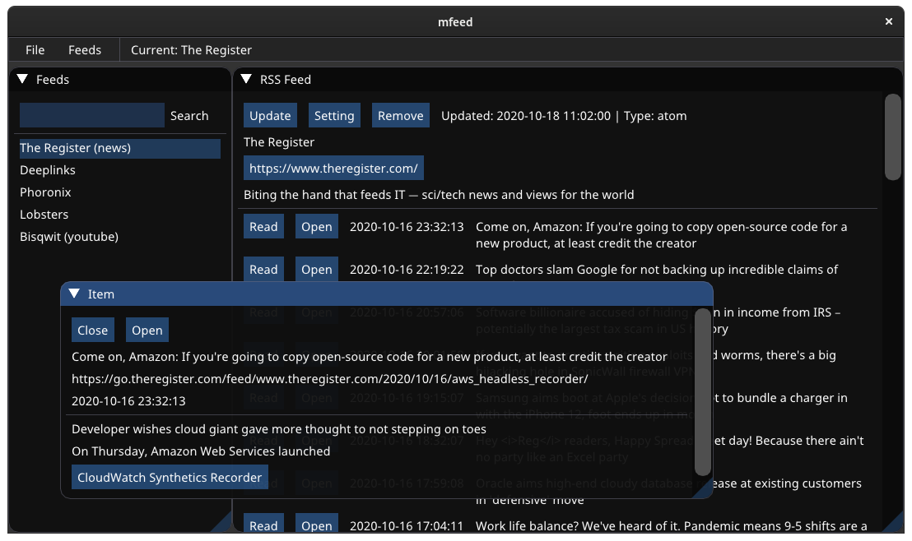

# mfeed
Mart's (Graphical) RSS Feed Reader written in C++20 + imgui

## Requirements
### To build
* C++20 and C
  * C++20: Must have [starts_with](https://en.cppreference.com/w/cpp/string/basic_string/starts_with) in `std::string` 
* [cmake](https://cmake.org/)

### Dependencies
* [libcurl](https://curl.haxx.se/libcurl/)
* [glfw](https://www.glfw.org/)

#### Embedded
These are already embedded in the project
* [imgui](https://github.com/ocornut/imgui)
* [glad](https://glad.dav1d.de/)
* [flatbuffers](https://github.com/google/flatbuffers)

#### cmake FetchContent
cmake automatically will just fetch them, so no actions needed
* [fmt](https://github.com/fmtlib/fmt)
* [pugixml](https://github.com/zeux/pugixml)
* [date](https://github.com/HowardHinnant/date)

### Assets
* [noto](https://www.google.com/get/noto/) - Font (Latin and CJK)

### Future/Planned Requirements
* C++20
  * Modules support (Whenever that arrives for gcc and cmake)
  * C++20 `std::chrono` date and times (Currently [date](https://github.com/HowardHinnant/date) is in place of it
  * Maybe: `std::format` over [fmt](https://github.com/fmtlib/fmt)

## Build
* `mkdir build`
* `cd build`
* `cmake -DCMAKE_BUILD_TYPE=Release ..`
* `make`

## Install
* `make install` or `sudo make install` (if `sudo` required)

## License
mfeed is licensed under the [GPLv3 (GNU General Public License v3.0)](LICENSE) ([gnu.org link](https://www.gnu.org/licenses/gpl-3.0.html)).

